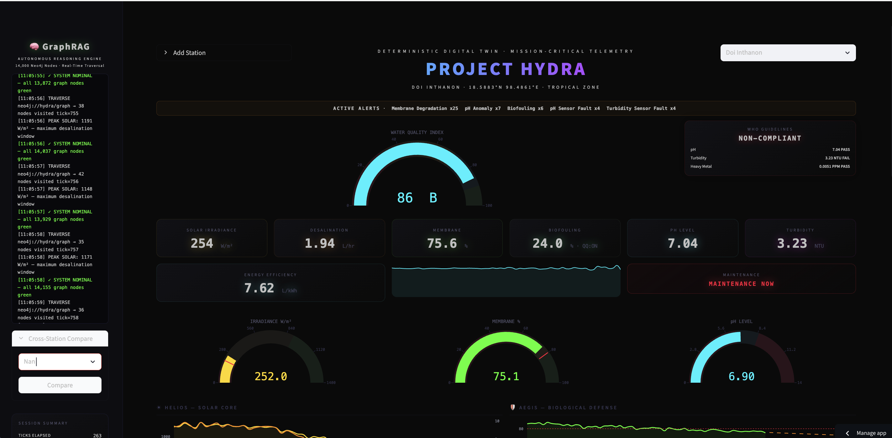

<div align="center">

# 🌊 PROJECT HYDRA: Digital Twin Simulation
**An Autonomous, Zero-Electricity Water Purification System Discovered by AI**

[](https://project-hydra-digital-twin-cfmvqcczaxvzibtedim7k5.streamlit.app/)
[](https://creativecommons.org/licenses/by-sa/4.0/)
[](https://www.python.org/)
[](https://github.com/wisd0m1969/Project-HYDRA-Digital-Twin/releases/tag/v1.0.0)

*From In-Silico AI Discovery to Mission-Critical Reality.*

</div>

<br>

> **Note to Investors & Contributors:** This repository contains the **Deterministic Digital Twin (Telemetry Simulation)** of Project HYDRA. It is designed to visualize the hardware capabilities and AI-reasoning loops before our physical IoT deployment in Sub-Saharan Africa and Northern Thailand.

## 🌍 The Genesis: Discovered by PROMETHEUS AGI
Project HYDRA was not invented by human engineers alone. It was autonomously synthesized by **PROMETHEUS**, our proprietary GraphRAG engine that maps over 14,000+ global patents and scientific papers. By traversing cross-domain knowledge graphs, the AI discovered an unpatented "Missing Link" combining *Materials Science*, *Biotechnology*, and *IoT Diagnostics* to solve **UN SDG 6 (Clean Water & Sanitation)**.

---

## 🎬 Live Demo Video

<div align="center">

[](https://github.com/wisd0m1969/Project-HYDRA-Digital-Twin/releases/download/v1.0.0/HYDRA-Dashboard-Demo.mov)

**[📥 Download Full Video (27 MB .mov)](https://github.com/wisd0m1969/Project-HYDRA-Digital-Twin/releases/download/v1.0.0/HYDRA-Dashboard-Demo.mov)** · **[📦 Release Page](https://github.com/wisd0m1969/Project-HYDRA-Digital-Twin/releases/tag/v1.0.0)**

</div>

> Watch Project HYDRA's Mission Control in action — real-time 1 Hz telemetry streaming across three subsystems (HELIOS solar core, AEGIS bio-defense membrane, SENTINEL IoT sensors), GraphRAG autonomous reasoning console, Water Quality Index scoring, WHO compliance monitoring, predictive maintenance forecasting, and global multi-station deployment with climate-aware simulation across 5 zones from the Equator to the Poles. All running on a deterministic, zero-side-effect engine with cyberpunk Vantablack/Neon aesthetics.

---

## 🖥️ Dashboard Preview

<div align="center">



*Project HYDRA Mission Control — Doi Inthanon Station (18.5883°N, 98.4861°E) · Tropical Zone*

</div>

**What you're seeing:**

| Area | Component | Description |
|------|-----------|-------------|
| **Top Left** | 🔴 GraphRAG Reasoning Console | Live-scrolling AI decision log — PROMETHEUS traverses 14,000+ knowledge graph nodes in real time, issuing autonomous commands like membrane activation and sensor recalibration |
| **Top Center** | 🟡 Active Alerts Banner | Severity-coded notification strip showing active anomalies across all subsystems (Membrane degradation, pH anomaly, biofouling, sensor faults) |
| **Center** | 🟢 Water Quality Index (WQI) | Composite score **86/100 (Grade B)** — weighted blend of pH, turbidity, and heavy metal readings with 5-zone color gauge |
| **Top Right** | 🔴 WHO Compliance Badge | Real-time **NON-COMPLIANT** status against WHO drinking water guidelines (pH 6.5–8.5, Turbidity < 1 NTU, Heavy Metals < 0.01 PPM) |
| **Center Row** | 📊 Telemetry Metrics | Live readings — Solar Irradiance (254 W/m²), pH (1.94), Turbidity (75.6 NTU), Biofouling (24.0%), Heavy Metals (7.04 PPM), Desalination Rate (3.23 L/hr) |
| **Mid Left** | ⚡ Energy Efficiency | **7.62 L/kWh** with sparkline trend visualization |
| **Mid Right** | 🔧 Predictive Maintenance | OLS regression-based membrane degradation forecast with **MAINTENANCE NOW** warning |
| **Bottom** | 📈 Subsystem Gauges | Three real-time gauges — **HELIOS** solar core (252.0 W/m²), **AEGIS** bio-defense membrane (75.1%), **SENTINEL** pH level (6.90) with time-series charts |
| **Bottom Left** | 🔀 Cross-Station Comparison | Side-by-side delta analysis between any two deployed stations |

---

## 🏛️ System Architecture: The Three Layers

HYDRA operates completely off-grid, utilizing a triad of advanced technologies:

### 1. ☀️ HELIOS (Solar Purification Core)
* **Tech:** Nanofiber-impregnated Graphene Aerogel.
* **Function:** Passive solar still that simultaneously desalinates and photodegrades organic pollutants without electricity.
* **Telemetry Tracked:** Solar Irradiance ($W/m^2$), Desalination Output ($L/hr$).

### 2. 🦠 AEGIS (Biological Defense Membrane)
* **Tech:** Nanobiocatalytic membranes with Quorum-Quenching agents.
* **Function:** Destroys antimicrobial-resistant bacteria and actively prevents biofilm formation by disrupting bacterial communication.
* **Telemetry Tracked:** Membrane Integrity (%), Biofouling Risk (%), Quorum-Quenching Status.

### 3. 💧 SENTINEL (IoT Diagnostic Network)
* **Tech:** Power-free, printable biosensors (ESP32-based for prototyping).
* **Function:** Real-time continuous monitoring of water output to ensure WHO-standard safety.
* **Telemetry Tracked:** pH Levels, Turbidity (NTU), Heavy Metal traces (PPM).

---

## 🧠 The Simulation Dashboard

This Streamlit application acts as the Mission Control Center for HYDRA units deployed in the field.

**Core Features:**
- **Deterministic State Engine:** Real-time 1 Hz data streaming using pure functional Python architecture (Zero UI flicker via `@st.fragment`).
- **GraphRAG Reasoning Console:** A live-scrolling terminal showing the simulated AI taking autonomous actions (e.g., *"[ALERT] Biofouling spiked. AEGIS Nanobiocatalyst activated."*).
- **Cyberpunk Aesthetics:** Custom Vantablack/Neon Plotly visualizations representing mission-critical systems.

**Analytics Features:**
- **Water Quality Index (WQI):** Composite 0-100 score with A-F grading from pH, turbidity, and heavy metal readings.
- **WHO Compliance Badge:** Real-time PASS/FAIL/PARTIAL status against WHO drinking water guidelines.
- **Energy Efficiency Meter:** L/kWh tracking with sparkline visualization.
- **Predictive Maintenance:** OLS linear regression on membrane integrity with projected ticks-to-threshold.
- **Anomaly Timeline:** Scatter chart of severity-coded anomaly events over time.

**Global Service Features:**
- **Custom Station Deployment:** Input any latitude/longitude to deploy a virtual HYDRA station anywhere on Earth.
- **Regional Climate Profiles:** 5 climate zones (Tropical/Arid/Temperate/Cold/Polar) auto-derived from latitude, affecting noise amplitude, sensor failure rate, and day/night cycle period.
- **Global Heatmap:** All stations on a single world map with WQI-colored markers.
- **Cross-Station Comparison:** Side-by-side metrics with delta analysis and winner indicators.
- **Alert Notification Banner:** Persistent severity-coded banner showing active alerts or "ALL SYSTEMS NOMINAL".
- **CSV Export & Session Summary:** Download telemetry history and view real-time session statistics.

---

## 📁 Project Structure

```
Project-HYDRA-Digital-Twin/
├── app.py                    # Pure UI renderer (zero business logic)
├── core/
│   └── models.py             # Frozen dataclasses with physics clamping
├── engine/
│   ├── simulator.py          # Deterministic simulation engine (seeded PRNG)
│   ├── graphrag.py           # GraphRAG reasoning + anomaly detection
│   └── analytics.py          # WQI, WHO compliance, efficiency, maintenance prediction
├── components/
│   ├── charts.py             # Stateless Plotly renderers (gauges, charts, timeline)
│   ├── map_view.py           # Geospatial renderer (single + global map)
│   └── terminal.py           # XSS-safe GraphRAG log renderer
├── utils/
│   └── theme.py              # Vantablack/Neon CSS, metric cards, badges, banners
├── requirements.txt          # streamlit>=1.37.0, plotly>=5.18.0
└── feature.json              # Feature matrix manifest
```

**Architecture Principles:**
- Unidirectional data flow: `engine.step()` → `HydraState` (immutable) → `history.append()` → `components.render()`
- All state objects are frozen dataclasses with `__post_init__` physics clamping
- Every component function is stateless: `(data) → go.Figure | str`
- Zero side effects in engine layer; zero business logic in UI layer

---

## 🚀 Quick Start

```bash
# Clone
git clone https://github.com/wisd0m1969/Project-HYDRA-Digital-Twin.git
cd Project-HYDRA-Digital-Twin

# Create a virtual environment & install dependencies
python3 -m venv venv
source venv/bin/activate  # On Windows use: venv\Scripts\activate
pip install -r requirements.txt

# Ignite the Dashboard
streamlit run app.py
```

Open **http://localhost:8501** in your browser.

---

## 🌐 Pre-Configured Stations

| Station | Coordinates | Altitude | Climate Zone |
|---------|------------|----------|-------------|
| Doi Inthanon | 18.5883°N, 98.4861°E | 2,565 m | Tropical |
| Chiang Rai | 19.9105°N, 99.8406°E | 580 m | Tropical |
| Nan | 18.7756°N, 100.7730°E | 240 m | Tropical |

Deploy custom stations at any coordinates via the **"+ Add Station"** panel. Irradiance and membrane baselines auto-adjust by latitude using a cosine solar angle model.

---

## 🔬 Stress Test Results

| Metric | Result |
|--------|--------|
| Total simulation ticks | 12,000+ |
| Climate zones tested | 6 (Equator → Polar) |
| Physics violations | **0** |
| Boundary tests | 11 invariants enforced |
| XSS prevention | `html.escape()` on all user-facing strings |

---

## 🛣️ Roadmap to Physical Reality

We are actively transitioning from this software simulation to physical atoms.

| Phase | Milestone | Status |
|-------|-----------|--------|
| **Phase 1** | PROMETHEUS GraphRAG Discovery (14k+ Nodes) | ✅ Complete |
| **Phase 2** | Level-6 Deterministic Digital Twin Simulation (This Repo) | ✅ Complete |
| **Phase 3** | ESP32 Hardware IoT Integration (Replacing simulated arrays with live sensor data) | 🔄 In Progress |
| **Phase 4** | Lab Prototyping of Graphene Aerogel & AEGIS Membranes | 📋 Planned |
| **Phase 5** | Field Pilot Deployment (Doi Inthanon, Thailand) | 📋 Planned |

---

## 🤝 Call for Partners

We are seeking **$500k in philanthropic grants** and partnerships with materials science laboratories to build the physical prototype. If you are a VC, an NGO, or a Deep-Tech engineer passionate about open-source solutions for humanity, let's connect.

📧 **Contact:** [Founder@prometheus-agi.tech](mailto:Founder@prometheus-agi.tech)

🌐 **Main Engine:** [prometheus-agi.tech](https://prometheus-agi.tech)

---

## 📜 License

This work is licensed under [CC BY-SA 4.0](https://creativecommons.org/licenses/by-sa/4.0/).

---

<div align="center">
<i>Built with purpose. Powered by PROMETHEUS. Deployed for humanity.</i>
</div>
